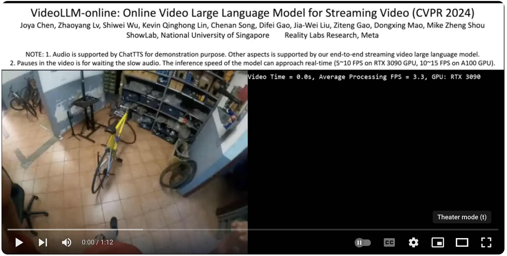

##  VideoLLM-online: Online Video Large Language Model for Streaming Video

<a href="https://showlab.github.io/videollm-online/" target="_blank"></a>
<a href="https://huggingface.co/spaces/chenjoya/videollm-online" target="_blank"></a>
<a href="https://arxiv.org/abs/2406.11816" target="_blank"></a>
<a href="https://huggingface.co/chenjoya/videollm-online-8b-v1plus" target="_blank"></a>
<a href="https://huggingface.co/datasets/chenjoya/videollm-online-chat-ego4d-134k" target="_blank"></a>

### TLDR

The first streaming video LLM, high speed (5 ~ 10 FPS on NVIDIA 3090 GPU, 10 ~ 15 FPS on A100GPU) on long-form videos (10 minutes), with SOTA performance on online/offline settings.

[](https://www.youtube.com/watch?v=09OoQwxQBoc)

### Introduction

This is the official implementation of [VideoLLM-online: Online Video Large Language Model for Streaming Video](...), CVPR 2024. Our paper introduces several interesting stuffs compared to popular image/video/multimodal models:

- **Online Video Streaming**: Unlike previous models that serve as offline mode (querying/responding to a full video), our model supports **online interaction within a video stream**. It can **proactively** update responses during a stream, such as recording activity changes or helping with the next steps in real time. Even GPT-4o, which is audio-driven, requires user voice interaction with the visual scene, not actual video streaming.

- **Cheap and Scalable Streaming Data Synthesis**: Current video datasets for training multimodal LLMs are mostly offline and unsuitable for training an online video language model. Our method **transforms any offline annotation into streaming dialogue data** by prompting open-source LLM. The model is entirely trained on Llama synthesized data.

- **Asynchronous Real-Time Inference**: Our inference method **parallelizes** video encoding, LLM forwarding for video frames, and LLM response generation, arranging them asynchronously. This significantly enhances real-time performance, achieving 10-15 FPS on an A100 GPU.

### Quick Start

- Try demo at <a href="..." target="_blank">  </a>
- Or launch the demo locally with:
```sh
python -m demo.app
```

### Installation

Ensure you have Miniconda and Python version >= 3.10 installed, then run:
```sh
conda install -y pytorch torchvision torchaudio pytorch-cuda=12.1 -c pytorch -c nvidia
pip install transformers accelerate deepspeed peft editdistance Levenshtein tensorboard gradio moviepy
pip install flash-attn --no-build-isolation
```

PyTorch source will make ffmpeg installed, but it is an old version and usually make very low quality preprocessing. Please install newest ffmpeg following:
```sh
wget https://johnvansickle.com/ffmpeg/releases/ffmpeg-release-amd64-static.tar.xz
tar xvf ffmpeg-release-amd64-static.tar.xz
rm ffmpeg-release-amd64-static.tar.xz
mv ffmpeg-7.0.1-amd64-static ffmpeg
```

If you want to try our model with the audio in real-time streaming, please also clone ChatTTS.

```sh
pip install omegaconf vocos vector_quantize_pytorch cython
git clone git+https://github.com/2noise/ChatTTS
mv ChatTTS demo/rendering/
```

### Training and Evaluation

- Download streaming dialogue data and Ego4D video features (google/siglip-large-patch16-384) from <a href="https://drive.google.com/drive/folders/1EfWu0lTpQH_p-HnwpBiZFwCE-OsUNagl?usp=sharing" target="_blank"></a>

- Refer to the examples under [scripts/](scripts/)

A more detailed instruction will be available soon.

### Model Zoo

#### [Live1+3x3-Llama3-8B](...)
* LLM: meta-llama/Meta-Llama-3-8B-Instruct
* Vision Strategy:
    * Frame Encoder: google/siglip-large-patch16-384
    * Frame Tokens: CLS token + 3x3 average pooled spatial tokens
    * Frame FPS: 2 for training, 2~10 for inference
    * Frame Resolution: max resolution 384, with zero-padding to keep aspect ratio
    * Video Length: 10 minutes
* Training Data: Ego4D Narration Stream 113K + Ego4D GoalStep Stream 21K 

#### [Live1-Llama3-8B](...) 
* LLM: meta-llama/Meta-Llama-3-8B-Instruct
* Vision Strategy:
    * Frame Encoder: google/siglip-large-patch16-384
    * Frame Tokens: CLS token
    * Frame FPS: 2 for training, 2~10 for inference
    * Frame Resolution: max resolution 384, with zero-padding to keep aspect ratio
    * Video Length: 60 minutes
* Training Data: Ego4D Narration Stream 113K + Ego4D GoalStep Stream 21K 

### VideoLLM-online beyond Llama

This codebase has a very simple and clean implementation. You only need to change the inherited class from Llama to Mistral to achieve the Mistral version of VideoLLM-online. Please refer to the examples in [models/live_llama](models/live_llama/).

### Citation

```
@inproceedings{live,
  author       = {Joya Chen and Zhaoyang Lv and Shiwei Wu and Kevin Qinghong Lin and Chenan Song and Difei Gao and Jia-Wei Liu and Ziteng Gao and Dongxing Mao and Mike Zheng Shou},
  title        = {VideoLLM-online: Online Video Large Language Model for Streaming Video},
  booktitle    = {CVPR},
  year         = {2024},
}
```
